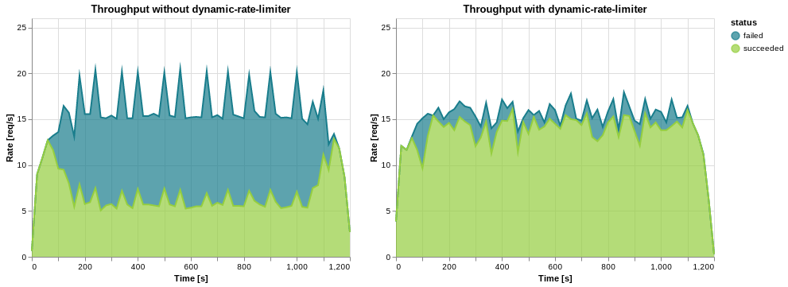
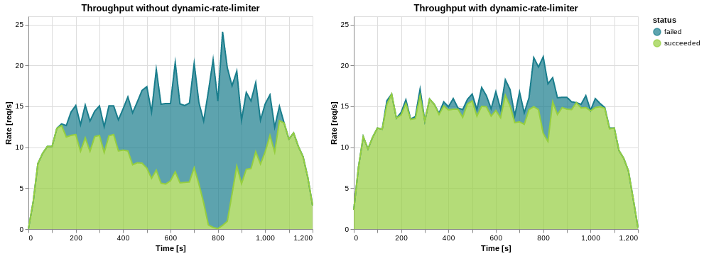

# DynRateLimiter

### About


 


### CI/CD


## Table of contents
* [Introduction](#introduction)
* [Run locally ...](#run-locally-)
  + [... via Go install](#-via-go-install)
  + [... by downloading latest release](#-by-downloading-latest-release)
  + [... and show usage](#-and-show-usage)
  + [... with configuration file](#-with-configuration-file)
* [Inject into Kubernetes pods](#inject-into-kubernetes-pods)
  + [Possible annotations for controlling DynRateLimiter](#possible-annotations-for-controlling-dynratelimiter)
* [Development](#development)
  + [Run and Test locally](#run-and-test-locally)

## Introduction

Rate limiting based on resource usage - either RAM and/or CPU. If resource usage rises above a defined threshold, rate limiting restricts further requests to avoid resource exhaustion by incoming request processing.

An initial rate limit is used to "slow start" the maximum allowed requests.

As shown in the figures below, DynRateLimiter can increase the total thoughput of requests in high load or high memory server scenarios.




## Run locally ...

### ... via Go install
```bash
go install github.com/arivum/dynratelimiter@v0.1.4
```

### ... by downloading latest release
```bash
sudo wget https://github.com/arivum/dynratelimiter/releases/download/v0.1.4/dynratelimiter -O /usr/bin/dynratelimiter
sudo chmod +x /usr/bin/dynratelimiter
```

### ... and show usage
```bash
dynratelimiter -h

Usage of dynratelimiter:
  -conf string
        Path to config file (default "dynratelimit.yaml")
  -cpu string
        Rate limiting threshold based on CPU usage. Notation must be either e.g. 80%% or 300ms
  -init-rate-limit int
        Initial rate limit. It is recommended to start small. (default 10)
  -loglevel string
        Set loglevel to one of [info, debug, warn, error, trace] (default "info")
  -ram string
        Rate limiting threshold based on RAM usage. Notation must be either e.g. 80%%, 2048MiB, 2048MB, 2GiB or 2GB
  -v    Display version
```

### ... with configuration file
```yaml
# configure thresholds that trigger rate limiting, once hit
thresholds:
  # initial request limit. "slow-starts" rate limiting
  initialRateLimit: 10
  # specify either:
  # * maximum cpu core fraction: e.g. 1core, 250m, 250mcores, 250000µ, 250000µcores
  # * maximum usage: e.g 80%
  cpu: 80%
  # specify either:
  # * total maximum RAM size: 4G, 4GB, 4GiB, 4096M, 4096MiB
  # * maximum percentage: 80%
  ram: 80%
# specify a list of interfaces to attach the ratelimiter.
# If list is empty, the ratelimiter will be attached to all interfaces in the current netns
interfaces:
  - lo
# specify logging options
logging:
  # loglevel must be one of [info, debug, warn, error, trace].
  # default: info
  level: debug
  # format can be one of [gofmt, json]
  # default: gofmt
  format: gofmt
```

## Inject into Kubernetes pods

To inject the DynRateLimiter into Kubernetes pods, deploy the DynRateLimiter Operator via Helm.

```bash
# Add the repository to helm
helm repo add arivum https://arivum.github.io/helm-charts
helm repo update

# Create your my_values.yaml to adjust default values for the operator
touch my_values.yaml

# Deploy the operator
helm upgrade --install -f my_values.yaml dynratelimiter-operator arivum/dynratelimiter-operator

# Show if operator came up successfully
kubectl --namespace dynratelimiter-operator get pods
```

For information about all settings for the Helm chart read [values.yaml](./build/helm/dynratelimiter-operator/values.yaml)

After the operator is up and running, you can inject the DynRateLimiter into various pods by simply settings pod annotations.

```yaml
apiVersion: v1
kind: Pod
metadata:
  name: get-injected
  annotations: 
    dynratelimiter.arifin.io/inject: "enabled"
    thresholds.dynratelimiter.arifin.io/cpu: "80%"
spec:
  containers:
  - name: main-container
    image: registry.hub.docker.com/library/busybox
    command: ["/bin/sh"]
    args: ["-c", "while true; do sleep 1; date; done"]
    resources:
      requests:
        memory: 100M
        cpu: 100m
      limits:
        memory: 100M
        cpu: 100m
```

### Possible annotations for controlling DynRateLimiter

| Annotation | Possible values |Description |
| ---------- | --------------- | ---------- |
| `dynratelimiter.arifin.io/inject` | `enabled` | Enable injection for this pod |
| `dynratelimiter.arifin.io/loglevel` | `info` (default), `debug`, `warn`, `error`, `trace` | Set logging level for the DynRateLimiter |
| `thresholds.dynratelimiter.arifin.io/cpu` | `80%`, `300m`, `300mcores` | Specify (percentual or absolute) CPU threshold that triggers rate limiting, once hit. |
| `thresholds.dynratelimiter.arifin.io/ram` | `80%`, `2048MB`, `2048MiB`, `2GiB`, `2GB` | Specify (percentual or absolute) RAM threshold that triggers rate limiting, once hit. |

## Development
### Run and Test locally

* Build eBPF object file and go binary (including binary representation of the eBPF object)
  ```bash
  go get github.com/cilium/ebpf/cmd/bpf2go
  make build
  make build-stressme
  ```
* Run with the sample configuration
  ```bash
  # run included stressme server e.g. with high load cpu profile
  ./stressme -cpu &

  # run dynamic rate limiter. eBPF function gets attached to lo interface
  # if example configuration stays untouched
  sudo ./dynratelimiter -conf examples/dynratelimit.yaml
  
  # simple loadtest using curl.
  # for more advanced load tests see ./tests/loadtests
  for i in {0..100}; do curl -q localhost:2000 &; done
  ```

<!-- ### Rate limit calculation
```math
\begin{aligned}
t \in [0,1]     &&&&&&&   \text{resource threshold} \\
r \in \N        &&&&&&&   \text{rate limit} \\
a \in \N        &&&&&&&   \text{accepted requests} \\
m_{max}         &&&&&&&   \text{available resource maximum} \\
m_{cur}         &&&&&&&   \text{current resource usage} \\
\text{}
\end{aligned}
```
```math
\Delta r = \left\{
  \begin{array}{ c l }
    r \cdot (t-\frac{m_{cur}}{m_{max}}) & \quad \textrm{if } (a \geq 0.8\cdot r \textbf{ || } m_{cur} \geq t \cdot  m_{max}) \\
    0                 & \quad \textrm{otherwise}
  \end{array}
\right.
``` -->
