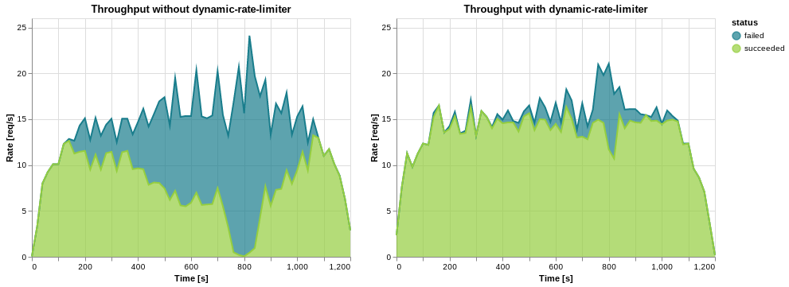

# K6 loadtest

## Base loadtest


### Without dynratelimiter (baseline)

```bash
docker run --rm --user 0 -i -e TARGET_IP=$(docker inspect bench --format='{{range.NetworkSettings.Networks}}{{.IPAddress}}{{end}}' | head -n 1) -v $PWD/tests/loadtest:/export loadimpact/k6 run --out json=/export/results/base.json - < tests/loadtest/k6_base.js
```

```text
✗ sucessfully got answer
↳  44% — ✓ 8271 / ✗ 10317

checks.........................: 44.49% ✓ 8271      ✗ 10317
data_received..................: 976 kB 813 B/s
data_sent......................: 1.5 MB 1.3 kB/s
http_req_blocked...............: avg=2.16ms  min=2.21µs  med=699.83µs max=24.12ms p(90)=6.69ms  p(95)=9.9ms  
http_req_connecting............: avg=1.44ms  min=0s      med=453.32µs max=19.88ms p(90)=4.1ms   p(95)=6.7ms  
http_req_duration..............: avg=4.49s   min=11.31ms med=5.09s    max=5.7s    p(90)=5.29s   p(95)=5.36s  
  { expected_response:true }...: avg=3.88s   min=11.31ms med=5s       max=5.7s    p(90)=5.28s   p(95)=5.3s   
http_req_failed................: 55.50% ✓ 10317     ✗ 8271 
http_req_receiving.............: avg=29.68µs min=0s      med=0s       max=10.59ms p(90)=67.22µs p(95)=98.57µs
http_req_sending...............: avg=8.31ms  min=8.65µs  med=239.4µs  max=4.82s   p(90)=2.35ms  p(95)=3.79ms 
http_req_tls_handshaking.......: avg=0s      min=0s      med=0s       max=0s      p(90)=0s      p(95)=0s     
http_req_waiting...............: avg=4.48s   min=11.19ms med=5.09s    max=5.7s    p(90)=5.29s   p(95)=5.36s  
http_reqs......................: 18588  15.489915/s
iteration_duration.............: avg=5.5s    min=1.01s   med=6.1s     max=6.71s   p(90)=6.29s   p(95)=6.37s  
iterations.....................: 18588  15.489915/s
vus............................: 1      min=1       max=100
vus_max........................: 100    min=100     max=100
```

### With dynratelimiter

```bash
docker run --rm --user 0 -i -e TARGET_IP=$(docker inspect bench --format='{{range.NetworkSettings.Networks}}{{.IPAddress}}{{end}}' | head -n 1) -v $PWD/tests/loadtest:/export loadimpact/k6 run --out json=/export/results/base_rate_limited.json - < tests/loadtest/k6_base.js
```

```text
✗ sucessfully got answer
↳  90% — ✓ 16383 / ✗ 1662

checks.........................: 90.78% ✓ 16383     ✗ 1662 
data_received..................: 1.9 MB 1.6 kB/s
data_sent......................: 1.4 MB 1.2 kB/s
http_req_blocked...............: avg=1.84s    min=0s      med=561.19µs max=15.39s p(90)=7.14s    p(95)=15.19s  
http_req_connecting............: avg=1.82s    min=0s      med=401.42µs max=15.39s p(90)=7.14s    p(95)=15.19s  
http_req_duration..............: avg=1.02s    min=0s      med=714.42ms max=33.61s p(90)=2.2s     p(95)=2.71s   
  { expected_response:true }...: avg=991.2ms  min=11.19ms med=762.25ms max=18.9s  p(90)=2.01s    p(95)=2.42s   
http_req_failed................: 9.21%  ✓ 1662      ✗ 16383
http_req_receiving.............: avg=52.96µs  min=0s      med=40.16µs  max=2.53ms p(90)=91.95µs  p(95)=117.74µs
http_req_sending...............: avg=42.26ms  min=0s      med=82.64µs  max=18.27s p(90)=261.02µs p(95)=390.64µs
http_req_tls_handshaking.......: avg=0s       min=0s      med=0s       max=0s     p(90)=0s       p(95)=0s      
http_req_waiting...............: avg=979.63ms min=0s      med=711ms    max=33.61s p(90)=2.13s    p(95)=2.67s   
http_reqs......................: 18045  15.029013/s
iteration_duration.............: avg=5.68s    min=1.01s   med=2.69s    max=34.61s p(90)=17s      p(95)=31s     
iterations.....................: 18045  15.029013/s
vus............................: 1      min=1       max=100
vus_max........................: 100    min=100     max=100
```

## Spike loadtest


## Without dynratelimiter

```bash
docker run --rm --user 0 -i -e TARGET_IP=$(docker inspect bench --format='{{range.NetworkSettings.Networks}}{{.IPAddress}}{{end}}' | head -n 1) -v $PWD/tests/loadtest:/export loadimpact/k6 run --out json=/export/results/spike.json - < tests/loadtest/k6_spike.js
```

```text
✗ sucessfully got answer
↳  55% — ✓ 9505 / ✗ 7652

checks.........................: 55.40% ✓ 9505      ✗ 7652 
data_received..................: 1.1 MB 934 B/s
data_sent......................: 1.4 MB 1.2 kB/s
http_req_blocked...............: avg=1.06ms   min=1.99µs  med=485.09µs max=18.83ms p(90)=2.67ms   p(95)=4.01ms 
http_req_connecting............: avg=786.03µs min=0s      med=315.89µs max=18.73ms p(90)=1.96ms   p(95)=3.18ms 
http_req_duration..............: avg=4.14s    min=11.01ms med=3.5s     max=21.59s  p(90)=7.2s     p(95)=11.88s 
  { expected_response:true }...: avg=2.68s    min=11.01ms med=2.51s    max=12.69s  p(90)=5.09s    p(95)=5.19s  
http_req_failed................: 44.59% ✓ 7652      ✗ 9505 
http_req_receiving.............: avg=26.45µs  min=0s      med=19.86µs  max=7.53ms  p(90)=58.18µs  p(95)=85.86µs
http_req_sending...............: avg=33.23ms  min=7.55µs  med=155.38µs max=9.7s    p(90)=945.97µs p(95)=1.56ms 
http_req_tls_handshaking.......: avg=0s       min=0s      med=0s       max=0s      p(90)=0s       p(95)=0s     
http_req_waiting...............: avg=4.11s    min=10.77ms med=3.5s     max=18.8s   p(90)=6.97s    p(95)=11.38s 
http_reqs......................: 17157  14.288152/s
iteration_duration.............: avg=5.14s    min=1.01s   med=4.51s    max=22.59s  p(90)=8.2s     p(95)=12.89s 
iterations.....................: 17157  14.288152/s
vus............................: 1      min=1       max=300
vus_max........................: 300    min=300     max=300
```

## With dynratelimiter

```bash
docker run --rm --user 0 -i -e TARGET_IP=$(docker inspect bench --format='{{range.NetworkSettings.Networks}}{{.IPAddress}}{{end}}' | head -n 1) -v $PWD/tests/loadtest:/export loadimpact/k6 run --out json=/export/results/spike_rate_limited.json - < tests/loadtest/k6_spike.js
```

```text
✗ sucessfully got answer
↳  92% — ✓ 16012 / ✗ 1340

checks.........................: 92.27% ✓ 16012     ✗ 1340 
data_received..................: 1.9 MB 1.6 kB/s
data_sent......................: 1.3 MB 1.1 kB/s
http_req_blocked...............: avg=1.36s    min=0s      med=350.04µs max=15.4s   p(90)=3.21s    p(95)=7.23s   
http_req_connecting............: avg=1.35s    min=0s      med=254.83µs max=15.4s   p(90)=3.21s    p(95)=7.23s   
http_req_duration..............: avg=831.99ms min=0s      med=672.63ms max=33.2s   p(90)=1.6s     p(95)=1.99s   
  { expected_response:true }...: avg=811.23ms min=10.88ms med=692.99ms max=19.77s  p(90)=1.59s    p(95)=1.88s   
http_req_failed................: 7.72%  ✓ 1340      ✗ 16012
http_req_receiving.............: avg=55.67µs  min=0s      med=39.06µs  max=17.01ms p(90)=85.83µs  p(95)=103.64µs
http_req_sending...............: avg=17.22ms  min=0s      med=72.95µs  max=18.12s  p(90)=218.79µs p(95)=310.67µs
http_req_tls_handshaking.......: avg=0s       min=0s      med=0s       max=0s      p(90)=0s       p(95)=0s      
http_req_waiting...............: avg=814.7ms  min=0s      med=671.67ms max=33.2s   p(90)=1.59s    p(95)=1.98s   
http_reqs......................: 17352  14.450462/s
iteration_duration.............: avg=5.16s    min=1.01s   med=2.3s     max=34.2s   p(90)=16.53s   p(95)=31s     
iterations.....................: 17344  14.4438/s
vus............................: 1      min=1       max=300
vus_max........................: 300    min=300     max=300
```